# 4g模块与服务器通信（http协议）

分享如何使用stm32通过4g模块与服务器进行通信。

### 1.整体介绍

单片机与服务器通信就像单片机与单片机的串口通信，不同的是串口通信的数据线换成了4g模块

主要介绍如何使用4g模块。至于stm32的串口通信就不细写了

#### 环境

硬件：stm32

​           YEDc780/YEDc100核心板+扩展版（4g模块**dtu固件**）

软件：用于与单片机通信的服务器接口

​          postman（测试接口功能的pc端软件）

​          串口调试助手，keil

### 2.实现步骤

要打通一条通信链（stm->4g->服务器->4g->stm）,需要一步步测试，下面从服务器接口开始测试。

#### 2.1测服务器接口

用postman测试服务器接口的url

从上到下介绍每一个红框

1.粘贴服务器接口的url（路径），红框左边的post根据实际修改为对应的请求方式

做服务器功能的人会给你url和请求方式（post/get）

2.测试的数据

这里的格式一定要是cjson格式，这个格式就是`{"变量名":"变量值"}` 注意符号用英文格式

3.200ok说明通信正常，遇到别的报错码到浏览器直接搜或者问gpt就行

4.这里是服务器返回的数据，比如这次我的需求是发送uid返回uid是否存在，以变量flag的值来确定，在红框中看到flag的值，说明功能正常，当然也可以更改一下红框2的uid为数据库已经存在的，测试flag 的值是否返回1

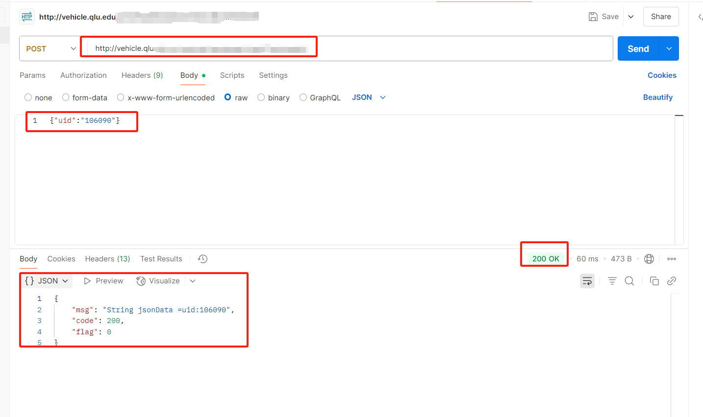

#### 2.2测试4g模块

4g模块我使用的是yedc780（dtu固件）

dtu固件和AT固件不同的是，dtu固件有一个专门用于配置的网页端后台，并且4g模块每次上电自动将配置更新到最新版本，并且可以批量分组操做，方便管理。

配置入门教程：[参数配置入门教程](https://yinerda.yuque.com/yt1fh6/4gdtu/textbcabgx9evwvd)

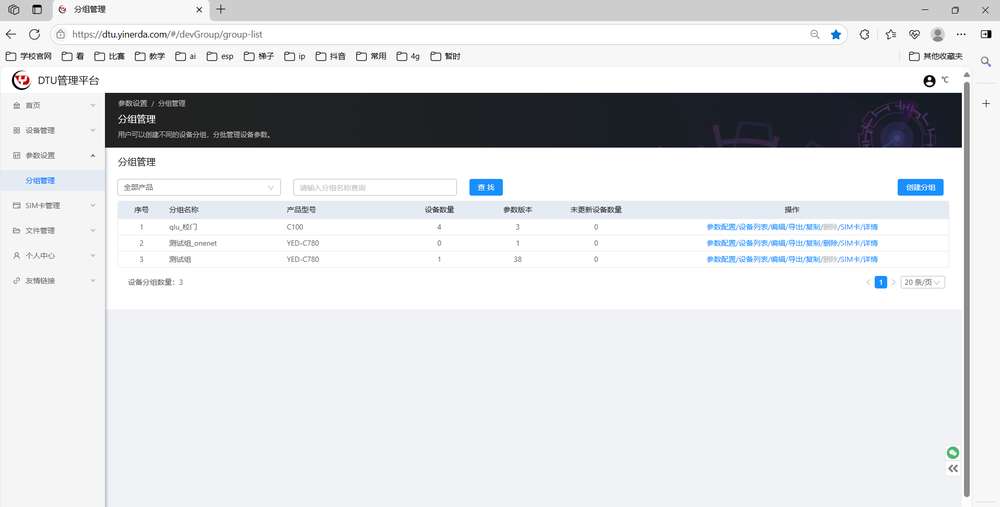

##### 配置

配置串口参数和网络通道参数

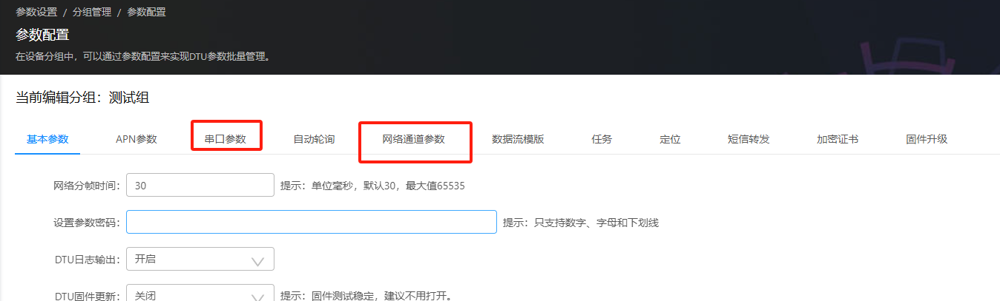

##### 2.2.1串口参数

##### 注意波特率就就行

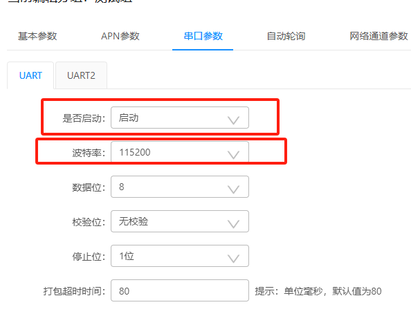

#### 2.2.2网络通道参数

服务器地址，端口号，请求的url这三个做服务器功能的人会给你

下面的自定义头部是为了4g模块能透传cjson数据，复制粘贴就行

Content-Type=application/json/0d/0aIMEI=${IMEI}/0d/0a

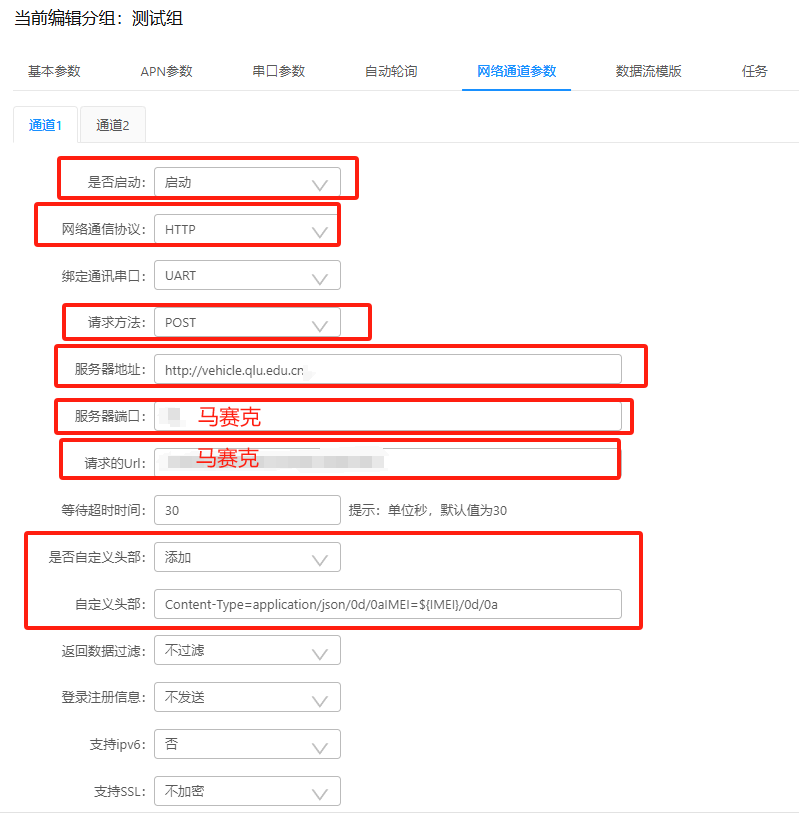

#### 2.2.3测试4g

把核心板插到扩展底板，连上电源线和串口数据线，插上sim卡，就可以用串口调试 助手测试了

直接发送    {"uid":"102090"}    看是否能接收到服务器返回的数据，接收到的数据结尾部分和postman接收的数据一致就是正常的

#### 2.3测试stm32串口

测试串口能否正常发cjson数据和能否处理服务器返回的数据提取flag的值。

这里就不详细介绍了

#### 2.3.1发送cjson数据

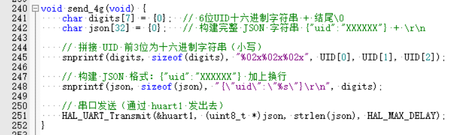

#### 2.3.2提取flag的值flag_value

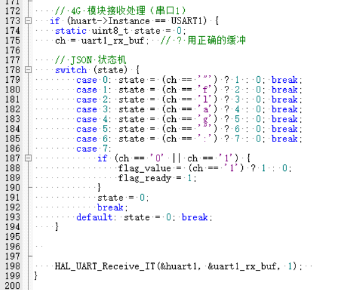

然后连线也记录一下方便后面的维护的人

uart1(PA9.PA10)连YEDc100核心板Tx1,Rx1

uart2(PA2,PA3)连读卡器的TX,RX

stm32和c100要共地

PB13连接继电器控制端，控制端与stm共地

c100输入为12v电源，测试时可以带扩展底板，实装只用核心板

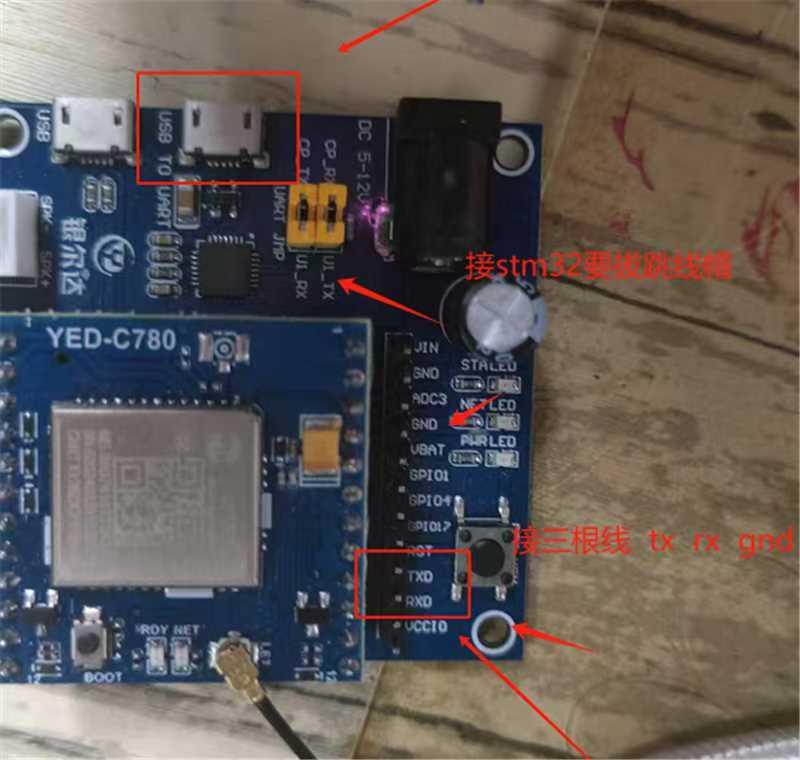

基本就这些，有问题联系我：		QQ:488763619

感兴趣负责维护的大一大二的橙果友友联系我，我给你们具体的服务器url

附上几张图片，安装北门时拍的

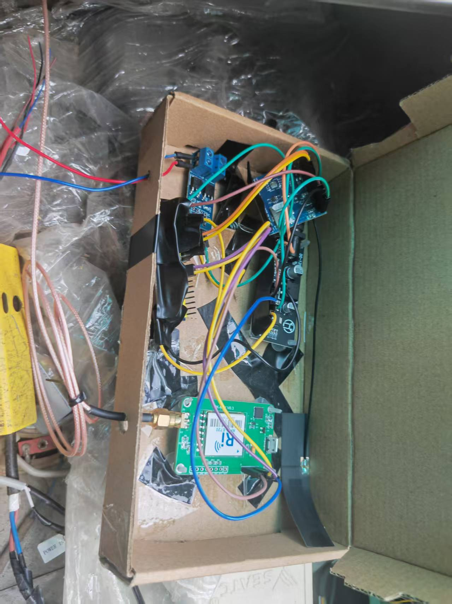

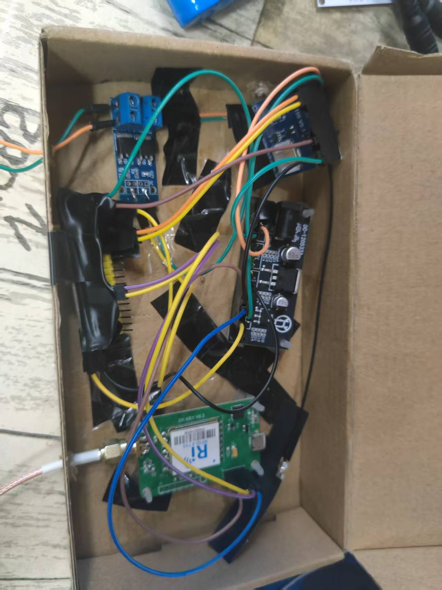

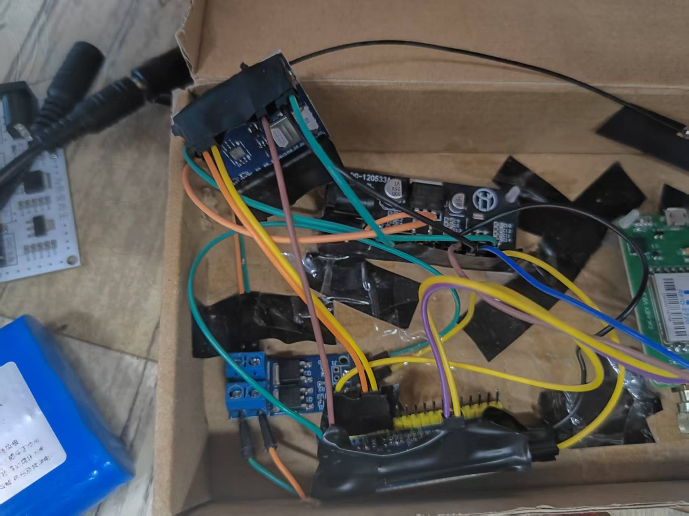

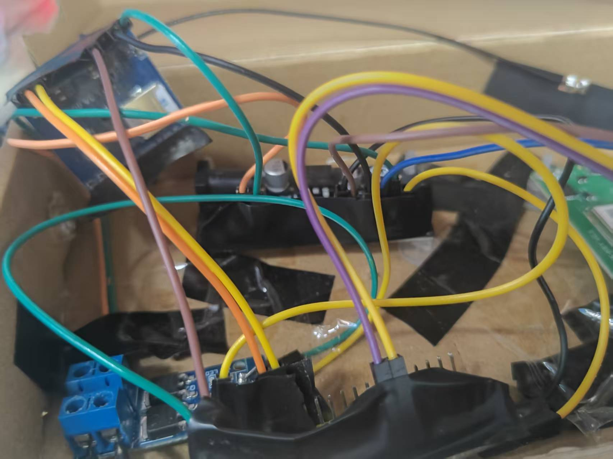